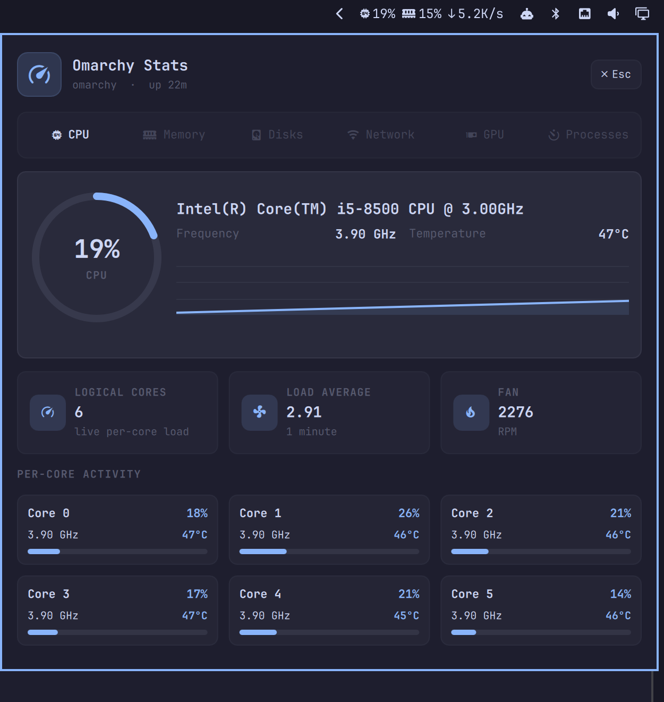
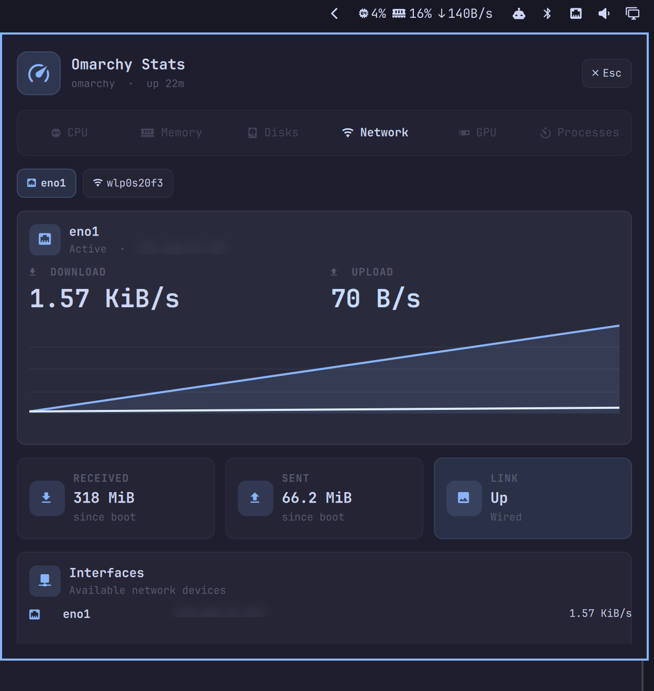
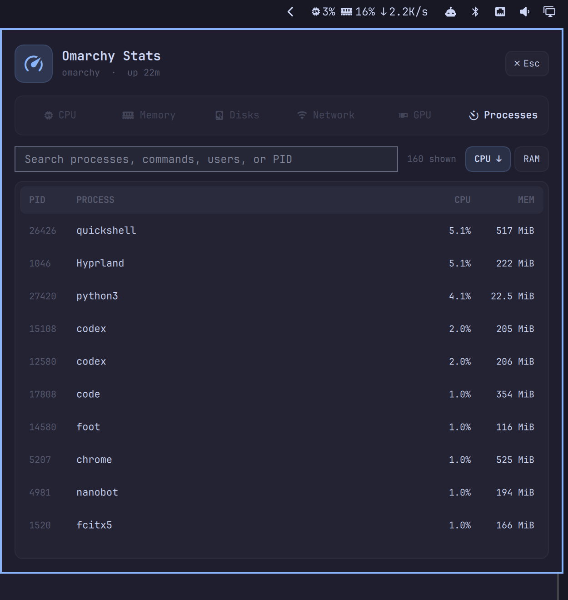

# Omarchy Stats

Omarchy Stats is a system monitor for the Omarchy bar. Its name comes from Stats, a menu-bar system monitor for macOS.

The widget keeps CPU usage, memory usage, and download speed visible in the bar. Click it to open a detailed system overview that follows your current Omarchy theme.

<p align="center">
  
</p>

## Features

- CPU usage, frequency, temperature, load, fan speed, and per-core activity
- Memory and swap usage
- Disk capacity and I/O activity
- Network speed, totals, addresses, and interface selection
- GPU usage, memory, temperature, frequency, and power when supported
- Searchable and sortable process list with guarded process controls
- Automatic integration with the current Omarchy theme

## Install

From GitHub:

```bash
omarchy plugin add https://github.com/yaotutu/omarchy-stats.git --enable
```

Move the widget if you want it in a different position:

```bash
omarchy bar move omarchy-stats --section right
```

To install from a local checkout instead:

```bash
./scripts/install-local.sh
```

## Usage

The bar widget displays three live values:

- CPU usage
- Memory usage
- Current download speed

Click the widget to open the details panel. Use the tabs at the top to switch between **CPU**, **Memory**, **Disks**, **Network**, **GPU**, and **Processes**.

Close the panel by clicking the widget again, clicking outside the panel, or pressing `Esc`.

### Network

The Network tab lets you switch between available interfaces and view current download/upload speeds, transferred totals, connection state, and IP address.

<p align="center">
  
</p>

### Processes

Use the search box to filter by process name, command, user, or PID. The list can be sorted by CPU or memory usage. Process actions ask for confirmation, and `KILL` requires a second confirmation.

<p align="center">
  
</p>

## Configuration

Settings can be changed with `omarchy bar set`:

| Setting | Description | Default | Range |
|---|---|---:|---:|
| `refreshSeconds` | Bar refresh interval in seconds | `1` | `1–10` |
| `barWidth` | Fixed width of the bar widget | `150` | `132–220` |
| `detailRefreshSeconds` | Details panel refresh interval in seconds | `1` | `1–10` |
| `netInterface` | Network interface used by the bar; empty uses all active interfaces | empty | — |

Examples:

```bash
# Refresh the bar every two seconds
omarchy bar set omarchy-stats refreshSeconds 2

# Make the widget wider
omarchy bar set omarchy-stats barWidth 170

# Refresh the details panel every two seconds
omarchy bar set omarchy-stats detailRefreshSeconds 2

# Use one interface for the download speed shown in the bar
omarchy bar set omarchy-stats netInterface eno1

# Return to all active interfaces
omarchy bar set omarchy-stats netInterface ""
```

Replace `eno1` with the interface name shown in the Network tab or by `ip link`.

## Update and remove

```bash
omarchy plugin update omarchy-stats --yes
omarchy plugin disable omarchy-stats
omarchy plugin remove omarchy-stats --yes
```

## Requirements

- Omarchy with shell plugin support
- Python 3
- Optional: `lspci` for additional GPU identification
- Optional: `nvidia-smi` for NVIDIA GPU metrics

Unsupported hardware values are shown as unavailable and do not prevent the plugin from loading.

## Privacy

Omarchy Stats reads system information locally. It does not send telemetry and does not require root privileges. Process controls are limited to processes owned by the current user.

## License

MIT. See [`LICENSE`](LICENSE).
